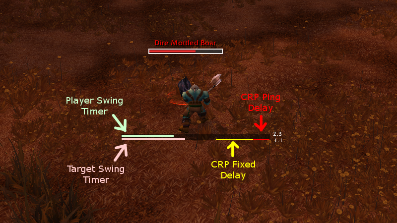
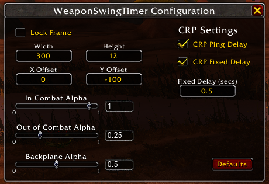

# WeaponSwingTimerAddon
WeaponSwingTimer is an addon for WoW Classic that tracks your's and your target's swing timer. It resets on abilities that would reset a swing timer, such as Warrior's Slam, and also takes parry haste into account. The frame can be moved around with the typical click-and-drag. A configuration window can be brought up with /wst /WeaponSwingTimer or /weaponswingtimer where more visual options are available.

## Crit Reactive Procs (CRPs) Update
A recent video by Esfand (https://www.youtube.com/watch?v=Op9kWkI4F-I) showed that Crit Reactive Procs can be triggered if correctly timed. 

This update is meant to create a tool that can be used to accurately study when the best time to stand up is. 

The image below shows the swing timer bars. The bars we care about for CRPs are the target swing timer, CRP ping delay, and CRP fixed delay.

**Ideally the player would stand up when the target's swing timer crosses the front of the CRP fixed delay's bar, causing the CRPs to trigger.**

Each of the CRP bars can be disabled and the length of the fixed delay can be changed.

## Installation
### Download
1. Click the download button on the repository's Github page, then select Download ZIP.
2. Wait for the zip file to download
3. Unzip the file into Interface\Addons.
4. It should look like Interface\Addons\WeaponSwingTimer\WeaponSwingTimer.toc
### Git Clone
1. Clone the repository into Interface\Addons.
2. It should look like Interface\Addons\WeaponSwingTimer\WeaponSwingTimer.toc
