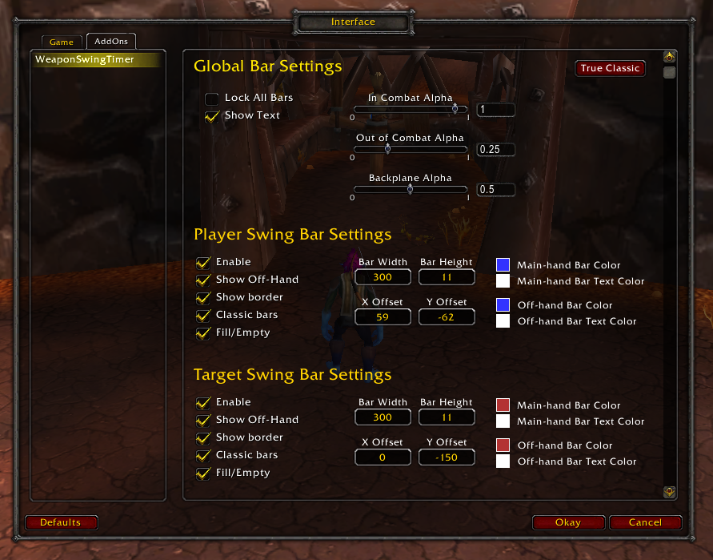
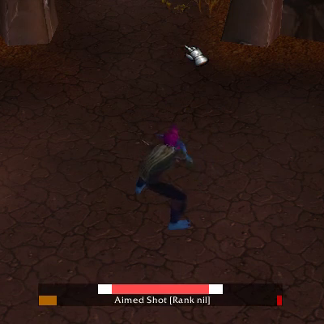
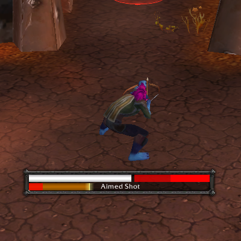
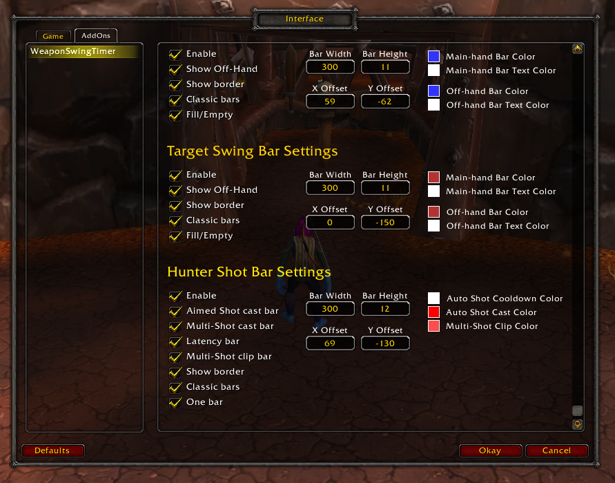

# WeaponSwingTimer
WeaponSwingTimer is an addon for WoW Classic that tracks your's and your target's swing timers.
If you're a hunter, it also tracks Auto Shot timing and castable shots cast time.

## Latest Update Video
https://www.youtube.com/watch?v=o_b7PZxIuls

## Melee Bars
The melee bars track the player's and target's main-hand and off-hand swings.
It resets on abilities that would reset a swing timer, such as Warrior's Slam, and also takes parry haste into account.
Both frames can be moved around with the typical click-and-drag.
A configuration window can be brought up with /wst /WeaponSwingTimer or /weaponswingtimer where more visual options are available.

## Hunter Bars
The hunter bars track the player's Auto Shot timing and also track the cast time for Aimed Shot and Multi-Shot.
The Auto Shot bar turns white when an Auto Shot is fired.
While the bar is white, the hunter can move and cast freely without clipping their next Auto Shot.
When the white bar is depleted, the hunter should stand still while their Auto Shot is 'casting'.

## Installation
### Download
1. Click the download button on the repository's Github page, then select Download ZIP.
2. Wait for the zip file to download
3. Unzip the file into Interface\Addons.
4. It should look like Interface\Addons\WeaponSwingTimer\WeaponSwingTimer.toc
### Git Clone
1. Clone the repository into Interface\Addons.
2. It should look like Interface\Addons\WeaponSwingTimer\WeaponSwingTimer.toc
