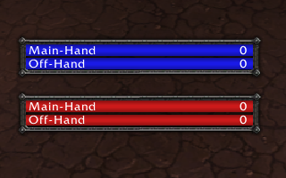
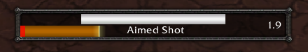
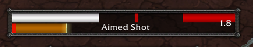
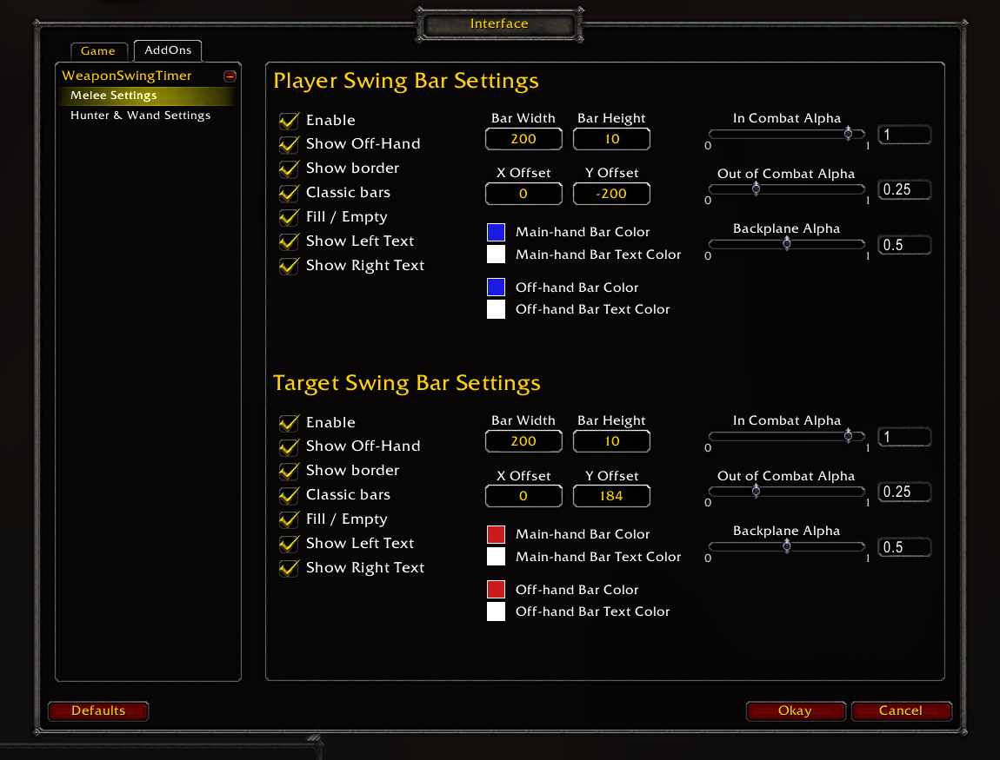
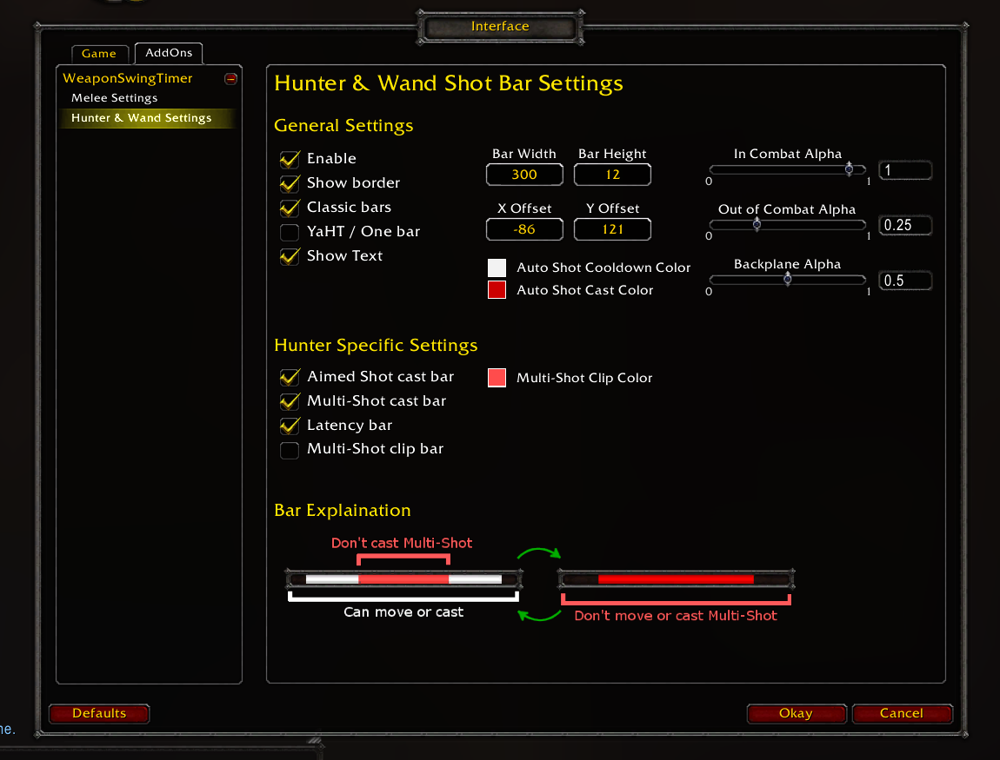

# WeaponSwingTimer
WeaponSwingTimer is an addon for WoW Classic that tracks your's and your target's swing timers.

If you're a hunter, it also tracks Auto Shot timing and castable shots cast time.

If you use a wand, it also tracks when your shot will go off.

## Latest Update Video
https://www.youtube.com/watch?v=o_b7PZxIuls

## Visuals
### Melee Bars

### YaHT Style Shot Bar

### One Bar Style Shot Bar

## Melee Bars
The melee bars track the player's and target's main-hand and off-hand swings.
It resets on abilities that would reset a swing timer, such as Warrior's Slam, and also takes parry haste into account.
Both frames can be moved around with the typical click-and-drag.
A configuration window can be brought up with /wst /WeaponSwingTimer or /weaponswingtimer where more visual options are available.

## Hunter/Wand Bars
The shot bars track the player's Auto Shot and Shoot timing and also track the cast time for Aimed Shot and Multi-Shot.
The shot bar turns white when projectile leaves the player.
While the bar is white, the player can move and cast freely without clipping their next Auto Shot or Shoot.
When the white bar is depleted, the player should stand still while their Auto Shot or Shoot is 'casting'.

## Installation
### CurseForge / WoW Interface
1. Download the latest version
2. Unzip the file into Interface\Addons.
3. It should look like Interface\Addons\WeaponSwingTimer\WeaponSwingTimer.toc
### GitHub
1. Click the download button on the repository's Github page, then select Download ZIP.
2. Wait for the zip file to download
3. Unzip the file into Interface\Addons.
4. It should look like Interface\Addons\WeaponSwingTimer\WeaponSwingTimer.toc
### Git Clone
1. Clone the repository into Interface\Addons.
2. It should look like Interface\Addons\WeaponSwingTimer\WeaponSwingTimer.toc
